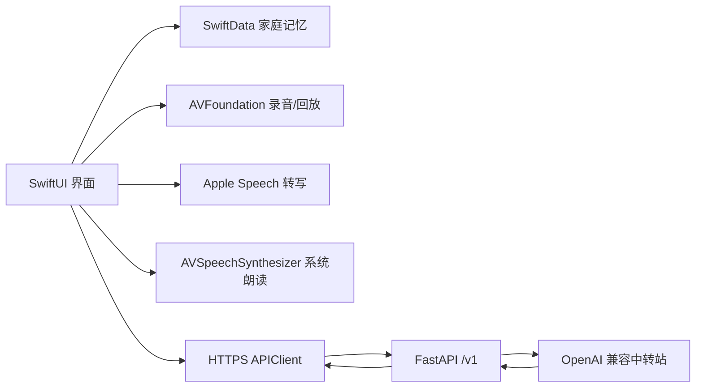

# KinVoice 家声：App 总结与 Mac 交付手册

版本：1.0.0 交付候选版  
整理日期：2026-07-25  
比赛截止：2026-07-31 23:59

## 1. 先读结论

KinVoice 家声已经收敛为一个面向 Apple 生态的家庭知识传承 App：iPhone 负责本地保存、录音、Apple 语音转写、系统朗读和交互；精简 FastAPI 后端只负责 AI 草稿与有来源问答。

Windows 侧已经完成源码、Xcode 工程、资源、plist、隐私清单、后端、Docker、测试和交付检查。**Windows 没有 Apple 编译器，因此“Xcode 编译通过”必须由接手的 Mac 同学执行本手册第 6 节后才能最终确认。** 不要在完成该步骤前对外宣称 TestFlight 已就绪。

## 2. 产品总结

### 产品定位

家声不是聊天机器人、声音克隆工具或电子相册，而是一个家庭知识传承库。它解决的是：长辈的做法、经验、家训和人生细节常以口述存在，普通照片与群聊无法把这些知识整理成下一代可以搜索、核对和继续使用的内容。

### 核心闭环

1. 用户选择讲述人并编辑采访问题。
2. 使用 iPhone 录下口述，试听后主动调用 Apple Speech 转写。
3. AI 把文字整理为草稿，不直接替家人保存事实。
4. 家人校订标题、摘要、正文、原话、人物、时间、地点和主题。
5. 记忆保存在本机 SwiftData，录音文件保存在 App 文档目录。
6. 用户可以搜索、编辑、回听原声或使用 Apple 系统普通话朗读。
7. “问家”只根据本机候选记忆回答，并展示可点击来源；没有有效来源时不展示无依据模型文本。

### 四个主页面

- 记忆库：搜索、浏览、编辑、删除、原声回放和系统朗读。
- 采集：采访问题、录音、试听、Apple Speech 转写、AI 草稿和人工校订。
- 问家：基于家庭资料的有来源问答。
- 家庭：成员新增、编辑、删除、演示数据恢复和隐私管理。

### 明确不包含

- 不使用 vivo SDK、vivo TTS 或 vivo 音色复刻。
- 不把中转站 API Key 放进 iOS App。
- 不在后端持久化家庭正文或录音。
- 不承诺多人实时同步、完整家谱或未经授权的声音克隆。

## 3. Apple 技术架构



iOS 最低版本为 iOS 17，目标设备为 iPhone。Xcode 工程不含第三方 Swift Package，减少了依赖下载和审核风险。

## 4. 赛事要求与评审重点

启航赛道初赛截止时间为 2026 年 7 月 31 日 23:59。作品必须已经上架或有 TestFlight，并且在 2025 年 7 月 31 日至 2026 年 7 月 31 日之间有更新。

启航赛道评分重点：

- 创新性 35%：设计创新、产品创新、服务创新。
- 商业前景 35%：商业模式、落地执行、盈利能力或潜力。
- 社会价值 20%：对社会文明等方面的推动。
- 团队展示与表达 10%：组织、分工、材料和表达。

家声的答辩重点应放在：真实家庭口述的结构化传承、人工校订、来源可追溯、本地优先隐私和可落地的家庭订阅/文化机构合作。不要把技术列表当成创新点。

初赛作品说明模板需要填写：问题背景与用户分析 200 字、竞品分析 200 字、可行性 300 字、App 创新点 300 字、应用前景 200 字。

## 5. 交付目录

```text
KinVoice-The-final-branch/
├── ios/                         iPhone 原生 App
│   ├── KinVoice.xcodeproj/      可直接用 Xcode 16+ 打开
│   ├── *.swift                  SwiftUI/SwiftData 源码
│   ├── Assets.xcassets/         不透明 1024px App Icon
│   ├── Info.plist               API 地址与权限文案
│   ├── PrivacyInfo.xcprivacy    Apple 隐私清单
│   ├── project.yml              XcodeGen 备用工程定义
│   └── verify_mac_build.sh      Mac 无签名模拟器构建检查
├── backend/                     精简 FastAPI 后端
│   ├── app/main.py              生产入口
│   ├── app/api/memory_ai.py     两个核心 /v1 接口
│   ├── Dockerfile
│   ├── docker-compose.yml
│   ├── requirements.txt
│   └── .env.example             无密钥配置模板
├── preview/                     Windows 浏览器演示
└── scripts/validate_delivery.py 跨平台静态交付检查
```

## 6. Mac 同学第一小时要做什么

### 6.1 解压与静态检查

不要从聊天工具直接在压缩包里打开工程，先完整解压。终端进入 `KinVoice-Apple-Handoff-2026-07-25/ios`（若改过文件夹名称，则进入其中的 `ios/`）：

```bash
python3 ../scripts/validate_delivery.py
bash verify_mac_build.sh
```

第二条命令会先确认当前选中的 Xcode 主版本至少为 16，再执行无签名的 iOS Simulator Debug 构建。只有终端最后出现 `KinVoice simulator build passed.` 才能记录为“Xcode 16+ 编译通过”。如失败，保留完整终端输出，不要只截最后一行。

### 6.2 Xcode 工程配置

双击 `ios/KinVoice.xcodeproj`：

1. 选择 KinVoice Target → Signing & Capabilities。
2. 勾选 Automatically manage signing。
3. 选择正确 Apple Developer Team。
4. 把 `com.kinvoice.familyarchive` 换成团队唯一 Bundle Identifier。
5. 确认 Deployment Target 为 iOS 17.0。
6. 在 `Info.plist` 把 `APIBaseURL` 替换为生产 HTTPS 地址，不能保留 `api.example.com`。
7. 若后端设置了 `APP_ACCESS_TOKEN`，把同值填入 `APIAccessToken`；不要填模型 API Key。
8. Product → Clean Build Folder，然后再次 Build。

### 6.3 模拟器检查

模拟器可以检查 SwiftData、列表、搜索、编辑、演示数据、问家网络 UI 和删除流程，但麦克风、Apple Speech、真机音频路由不能只靠模拟器验收。

### 6.4 真机检查

连接 iPhone，首次运行依次允许麦克风和语音识别：

- 完成一段 20-40 秒普通话录音。
- 结束后试听，确认声音正常且没有爆音。
- 点击 Apple 语音转写，校对人名、地名和年代。
- 断网保存一条本地草稿，确认核心流程仍可用。
- 恢复网络后执行 AI 整理和问家，确认来源可点击。
- 强制退出并重启，确认记忆和录音仍存在。
- 删除全部家庭数据，确认录音文件一并删除。

## 7. 后端与中转站

### 7.1 配置原则

只在服务器 `backend/.env` 中填写：

```dotenv
LLM_API_KEY=你的密钥
LLM_API_BASE=https://中转站地址/v1
LLM_MODEL=中转站模型标识
```

中转站必须兼容 `POST /v1/chat/completions`。`LLM_API_BASE` 不要包含结尾的 `/chat/completions`。

### 7.2 本地验证

```bash
cd backend
cp .env.example .env
# 编辑 .env
python3 -m venv .venv
source .venv/bin/activate
pip install -r requirements.txt
python -m unittest discover -s tests -p 'test_*.py' -v
uvicorn app.main:app --reload --port 8000
```

访问 `http://127.0.0.1:8000/health`，应看到 `status: ok` 和 `llm_configured: true`。

### 7.3 生产部署

使用 `docker compose up -d --build` 部署，并在云平台或反向代理配置有效 HTTPS、请求限流、费用上限和 5xx 告警。生产环境建议关闭 Swagger：`DOCS_ENABLED=false`。

不要为了真机访问临时添加 HTTP/ATS 例外。TestFlight 只能配置稳定 HTTPS 地址。

## 8. TestFlight 操作

1. 在 App Store Connect 创建 App 记录，Bundle ID 必须与 Xcode 完全一致。
2. 填写 App 名称、主语言、SKU、隐私政策 URL 和支持 URL。
3. Xcode 选择 Any iOS Device (arm64)。
4. Product → Archive。
5. Organizer → Distribute App → App Store Connect → Upload。
6. 等待构建处理，处理出口合规和隐私问卷。
7. 先添加内部测试成员安装验证。
8. 创建外部测试组，填写 Beta App Description、反馈邮箱和审核说明。
9. 提交 Beta App Review，生成评委可以访问的外部 TestFlight 链接。
10. 用一台未登录开发账号的 iPhone 实际安装链接，避免只验证内部权限。

## 9. 发布前验收清单

- [ ] `bash verify_mac_build.sh` 通过。
- [ ] Release 配置 Build 通过，无新增 warning 需要阻断处理。
- [ ] Bundle ID、Team、版本号和构建号正确。
- [ ] `APIBaseURL` 是生产 HTTPS，`api.example.com` 已消失。
- [ ] App 内和仓库中没有模型 API Key。
- [ ] iPhone 真机录音、试听、Apple Speech 转写、原声回放和系统朗读通过。
- [ ] AI 超时或断网时草稿不丢失。
- [ ] 问家每个事实回答有来源，或显示“可能相关原文/资料不足”。
- [ ] 删除全部数据同时删除 SwiftData 与录音文件。
- [ ] iPhone SE/标准/Max 尺寸无文字截断。
- [ ] 动态字体、深色模式、VoiceOver 和权限拒绝场景检查完成。
- [ ] TestFlight 外部链接由非开发者设备成功安装。
- [ ] 比赛平台上的说明文档和效果图可以在线预览。

## 10. 已知限制与注意事项

- Apple Speech 可用性受地区、网络和设备状态影响，因此始终保留手动文字输入。
- App 目前是单设备本地库，不含 CloudKit 家庭共享。
- `APIAccessToken` 只能降低公开接口被随意调用的概率，不能当作不可提取的客户端秘密。
- App Icon 已处理为无透明通道，但视觉风格仍可在首个成功构建后继续优化，不应因此延误 TestFlight。
- 旧快应用和 vivo 文件只用于原创过程留档，不由赛事后端入口加载，也不应加入 Mac 交付包的运行说明。
- 每次 Archive 前递增 `CURRENT_PROJECT_VERSION`，上传过的构建号不能重复。

## 11. 出错时如何回传

Xcode 构建失败时，请提供：

1. Xcode 完整版本号。
2. 运行的命令或所选 Scheme/设备。
3. 第一条红色编译错误及其前后至少 20 行日志。
4. 报错文件和行号。
5. 是否修改过 `project.pbxproj`、Bundle ID 或 Deployment Target。

不要只发送“编译失败”或最后一条连带错误。优先修第一条错误，后续错误通常会随之消失。
