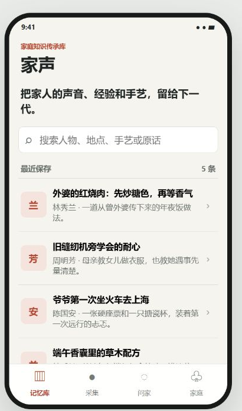
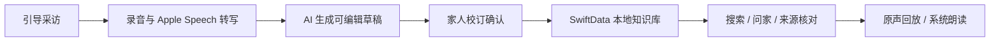
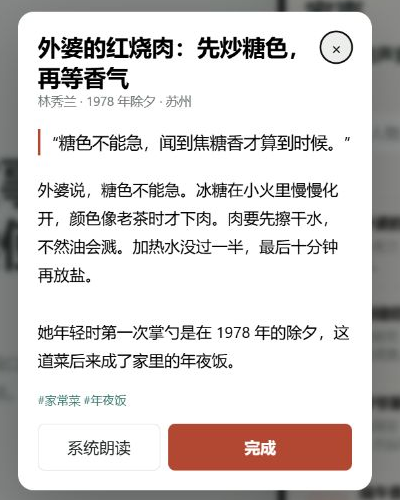
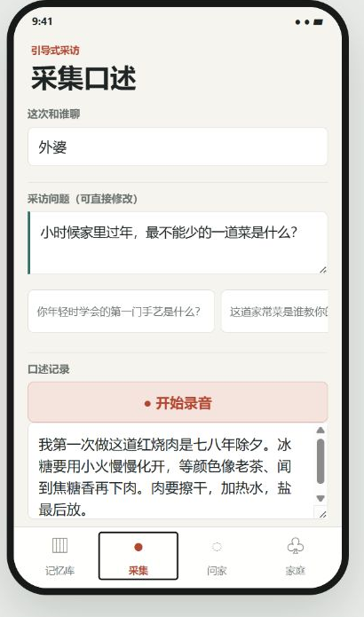
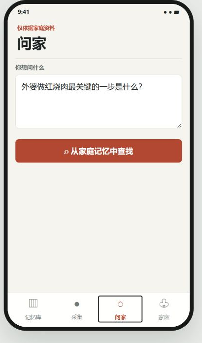
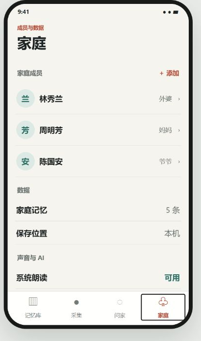
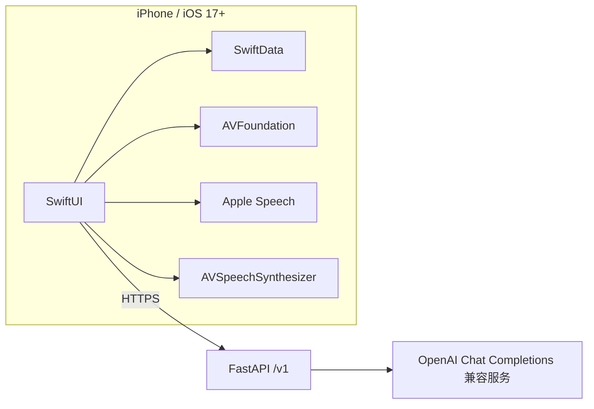

<div align="center">
  
  <h1>KinVoice 家声</h1>
  <p><strong>把家人的声音、经验和手艺，整理成可校订、可追问、可回听的家庭知识库。</strong></p>
  <p>
    
    
    
    
    
  </p>
</div>

<p align="center">
  
</p>

KinVoice 家声面向希望记录父母、祖辈故事与生活经验的家庭。它不是通用聊天机器人，也不是声音克隆工具；它围绕一条完整的传承链路工作：**采访、录音、转写、AI 整理、家人校订、保存、检索、带来源问答与原声回听**。

项目面向 Apple 生态开发，也是 2026 年移动应用创新赛启航赛道的参赛作品工程。

## 核心闭环



- **证据优先**：原始录音、原话、人物、时间和地点都可以随记忆保存。
- **家人做主**：语音转写和 AI 输出都只是草稿，保存前必须可编辑确认。
- **有据可查**：“问家”只根据候选家庭记忆回答，并返回可点击来源。
- **本地优先**：记忆与录音默认保存在 iPhone；后端不持久化家庭正文。
- **Apple 原生**：SwiftUI、SwiftData、AVFoundation、Speech 与 AVSpeechSynthesizer。

## 界面预览

以下图片来自仓库 `preview/` 的真实交互实现，与原生 App 的信息架构和演示数据一致。

<table>
  <tr>
    <td align="center"><br /><strong>记忆库</strong><br />人物、地点、主题与原话检索</td>
    <td align="center"><br /><strong>记忆详情</strong><br />来源线索、原话与系统朗读</td>
  </tr>
</table>

<table>
  <tr>
    <td align="center"><br /><strong>采集</strong><br />可编辑采访题、录音与转写</td>
    <td align="center"><br /><strong>问家</strong><br />仅依据家庭资料进行回答</td>
    <td align="center"><br /><strong>家庭</strong><br />成员档案与本地数据管理</td>
  </tr>
</table>

## 技术架构



### iOS

- SwiftUI 四 Tab 信息架构：记忆库、采集、问家、家庭。
- SwiftData 保存家庭成员与结构化记忆。
- AVFoundation 负责录音、试听和原声回放。
- Apple Speech 负责用户主动触发的录音后转写。
- AVSpeechSynthesizer 提供系统普通话朗读。
- 无第三方 Swift Package，减少构建与审核风险。

### 后端

- `GET /health`
- `POST /v1/memories/draft`
- `POST /v1/knowledge/ask`

后端是无状态的 AI 适配层：不保存家庭记忆或录音，只接收完成当前请求所需的文字。模型回答没有有效来源时，服务会拒绝展示无依据内容或降级为可核对原文。

## 快速开始

### 环境要求

- macOS 与 Xcode 16+
- iOS 17+ Simulator Runtime
- Python 3.11 或 3.12（仅后端）

### 免费运行 iOS 模拟器

iOS Simulator 和 SwiftUI Canvas **不需要付费 Apple Developer 账号，也不需要在 Apple 后台注册 Bundle ID**。

```bash
git clone https://github.com/eeggyy123/Kinvoice-iOS.git
cd Kinvoice-iOS/ios
python3 ../scripts/validate_delivery.py
bash verify_mac_build.sh
open KinVoice.xcodeproj
```

在 Xcode 顶部选择 `KinVoice` Scheme 和一个具体的 iPhone Simulator，然后按 `Command + R`。不要选择 `Any iOS Device (arm64)`、真机或 `My Mac`。

如果设备列表没有模拟器，请进入 `Xcode > Settings > Components/Platforms` 下载 iOS Simulator Runtime，再到 `Window > Devices and Simulators` 创建 iPhone 模拟器。

SwiftUI Canvas：打开 `RootTabView.swift`，按 `Option + Command + Return`，点击 `Resume`。预览使用独立的内存数据库，不会修改模拟器或真机数据。

> 只有真机安装、TestFlight 和 App Store 发布需要 Apple Developer Program 与正式签名。

### 浏览器交互预览

Windows 或 macOS 都可以直接预览主要流程：

```bash
python -m http.server 4173 --bind 127.0.0.1 --directory preview
```

打开 [http://127.0.0.1:4173/](http://127.0.0.1:4173/)。预览数据只保存在当前浏览器中，不会上传。

### 启动 AI 后端

```bash
cd backend
cp .env.example .env
python3 -m venv .venv
source .venv/bin/activate
pip install -r requirements.txt
python -m unittest discover -s tests -p 'test_*.py' -v
uvicorn app.main:app --reload --port 8000
```

在服务器 `.env` 中填写 OpenAI Chat Completions 兼容配置：

```dotenv
LLM_API_KEY=your-secret-key
LLM_API_BASE=https://your-relay.example/v1
LLM_MODEL=your-model-name
```

模型密钥只能保存在服务器，不得写入 Swift、`Info.plist`、README、截图或 Git 历史。iOS 的 `APIBaseURL` 应指向部署后的 KinVoice HTTPS 后端，而不是模型中转站本身。

## 隐私与安全边界

- 家庭记忆和录音默认保存在本机。
- 只有用户主动使用 AI 整理或问答时，才发送当前请求所需文字。
- 后端日志只记录字符数、候选条目数量和错误类型，不记录家庭正文。
- 删除全部本地数据时，同时删除 SwiftData 条目与关联录音文件。
- 当前版本不提供声音克隆，不依赖 vivo SDK 或 vivo TTS。
- `.env`、API Key、私钥、日志、数据库和虚拟环境均不应提交。

## 项目结构

```text
Kinvoice-iOS/
├── ios/                         SwiftUI / SwiftData 原生 iPhone App
│   ├── KinVoice.xcodeproj/      Xcode 16+ 工程与共享 Scheme
│   ├── Assets.xcassets/         App Icon 与资源
│   ├── PrivacyInfo.xcprivacy    Apple 隐私清单
│   └── verify_mac_build.sh      无签名模拟器构建检查
├── backend/                     精简 FastAPI AI 适配层
├── preview/                     浏览器交互预览
├── docs/                        产品决策、计划、审计和交付文档
├── scripts/                     跨平台交付校验与打包脚本
└── competition-materials/       赛事规则与参考材料
```

## 当前范围

已实现：本地记忆 CRUD、完整搜索、家庭成员 CRUD、采访题编辑、录音与试听、录音后 Apple Speech 转写、AI 草稿、人工校订、带来源问答、原声回放、系统朗读、演示数据和隐私删除。

尚未纳入当前版本：CloudKit 多设备共享、实时边录边转写、完整家谱和声音克隆。这些能力不会在项目介绍中被描述为已完成。

## 文档

- [产品理解与决策](docs/00-理解与产品决策.md)
- [七天 TestFlight 交付计划](docs/01-七天交付计划.md)
- [现有工程审计](docs/02-现有工程审计.md)
- [提交前待办与产品打磨](docs/03-提交前待办与产品打磨.md)
- [App 总结与 Mac 交付手册](docs/04-App总结与Mac交付手册.md)
- [交付验收状态](docs/05-交付验收状态.md)
- [产品优化与商业化规划](docs/06-KinVoice产品优化与商业化规划.md)

## License

本项目使用 [MIT License](LICENSE)。
